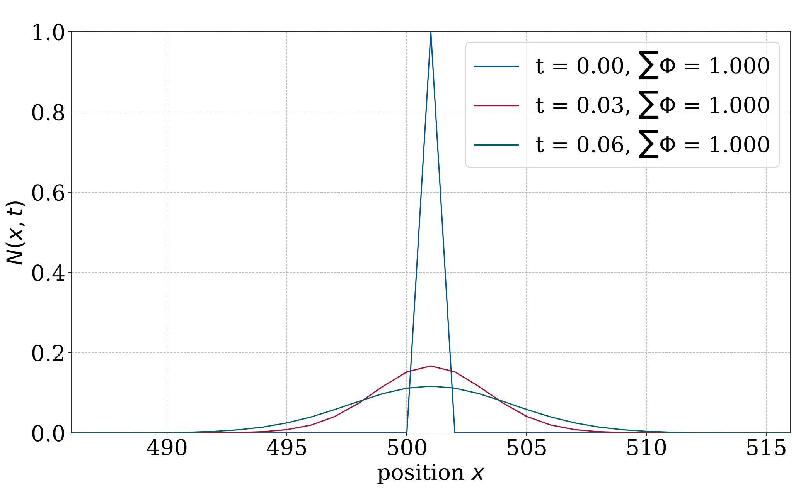
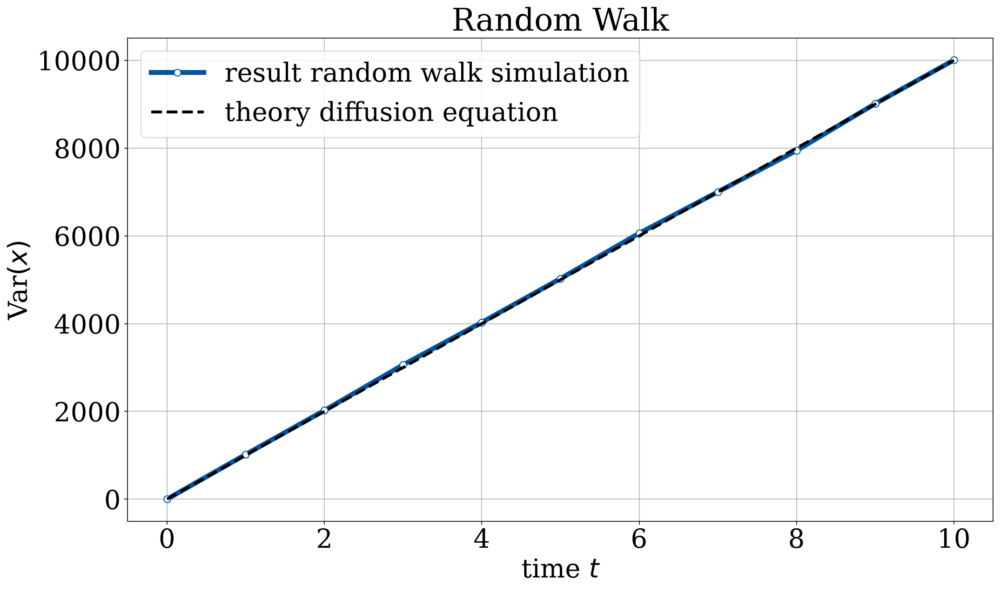

# The diffusion equation

The diffusion equation $\partial N/\partial t = D\,\partial^2 N/\partial x^2$ describes
how a concentration spreads out over time. I solve it two ways here, with a
deterministic PDE solver and with a microscopic random walk, and check that they
agree with each other and with theory.

## Method

For the PDE solver the time-evolution operator $\exp(\alpha\tau H)$ is factorised by
splitting the discrete Laplacian $H = A + B$ into two block-diagonal parts and using
the symmetric, second-order approximation

$$\exp(\alpha\tau H) \approx \exp(\tfrac{1}{2}\alpha\tau A)\,\exp(\alpha\tau B)\,\exp(\tfrac{1}{2}\alpha\tau A),$$

where each factor can be applied in closed form on $2\times 2$ blocks. I used
$L = 1001$ grid points, $\Delta = 0.1$, $\tau = 0.001$ and $D = 1$.

Separately, as a check, $10^4$ particles perform independent unbiased random walks
(fixed seed 1069). That gives a microscopic picture of the same diffusion process.

## Results

Starting from a sharp spike at the centre, the density spreads out into the usual
diffusive (Gaussian) shape:



The characteristic feature of diffusion is that the variance grows linearly in
time, with slope $2D/\Delta^2 = 200$. The product-formula solver gives a slope of
$199.34$, so under 0.5 % off:


The random walk gives the same linear growth independently, which confirms that
the microscopic and continuum descriptions line up:



So the second-order splitting scheme hits the variance to better than a percent,
and the random walk reproduces the same continuum law from the particle picture.

## Running it

```bash
python DE_1.py     # product-formula solver -> Data/, Plots/
python DE_2.py     # random-walk check      -> Plots/
```

- `DE_1.py` — product-formula PDE solver (uses Numba)
- `DE_2.py` — random-walk check
- `Data/` — stored variance arrays
- `Plots/` — output figures

Dependencies: `numpy`, `matplotlib`, `numba` (see `requirements.txt` in the repo root).
