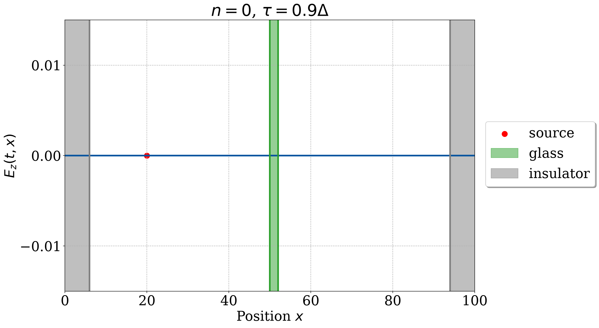
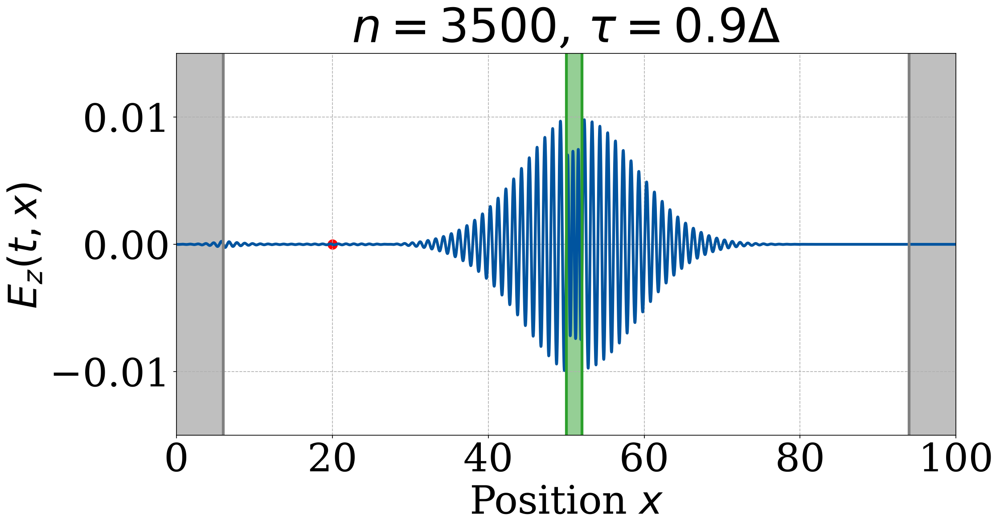
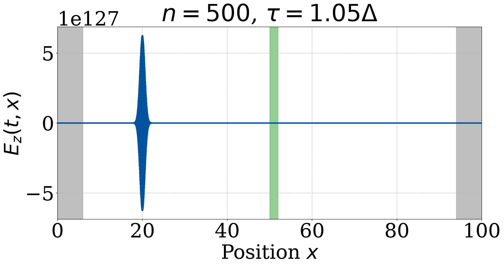

# 1D electromagnetic waves with the Yee algorithm

This project solves Maxwell's equations in one dimension with the Yee
finite-difference time-domain (FDTD) scheme, and uses it to look at how a pulse
of light reflects and transmits when it hits a glass plate.

## Method

In the Yee scheme the electric field $E_z$ and the magnetic field $H_y$ sit on a grid
that is staggered by half a cell in both space and time, so each field is updated
from the spatial differences of the other. This leap-frog arrangement is what
makes FDTD both simple and stable. The wave is launched from a Gaussian-modulated
sinusoidal source, and absorbing layers at the two ends of the domain (an electric
conductivity $\sigma$ and a magnetic loss $\sigma^*$) stop the boundaries from reflecting
the wave back in. The glass plate is modelled with a refractive index of
$n_d = 1.46$.

I used a wavelength of $\lambda = 1$, grid spacing $\Delta = \lambda/50$, and a domain of
length $100\lambda$.



## Results

When the pulse reaches the plate, part of it goes through and part is reflected.
The snapshot below shows the packet while it is interacting with a thin glass
plate:



For the thick plate the measured reflection coefficient comes out to $R = 0.03537$,
which matches the analytic Fresnel value to about $4\times 10^{-4}$.

The scheme is only stable if the time step satisfies the Courant condition. With
$\tau = 0.9\,\Delta$ the simulation is stable, but with $\tau = 1.05\,\Delta$ it is not, and
the field amplitude blows up to around $10^{127}$ within a few hundred steps:



So a fairly simple staggered-grid update reproduces reflection and transmission at
a dielectric interface to four digits, as long as the time step stays below the
stability limit.

## Running it

```bash
python EM_Waves.py      # writes the snapshots to Plots/
```

- `EM_Waves.py` — the FDTD solver and plotting (uses Numba)
- `Plots/` — output figures

Numba compiles the solver the first time it runs; after that the full set of
snapshots only takes a few seconds. Dependencies: `numpy`, `matplotlib`, `numba`
(see `requirements.txt` in the repo root).
