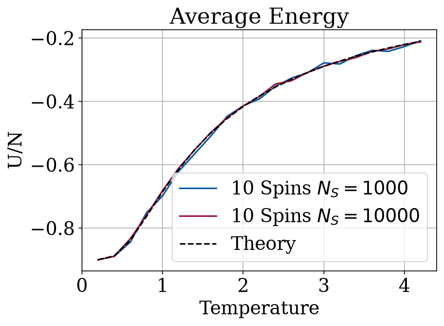
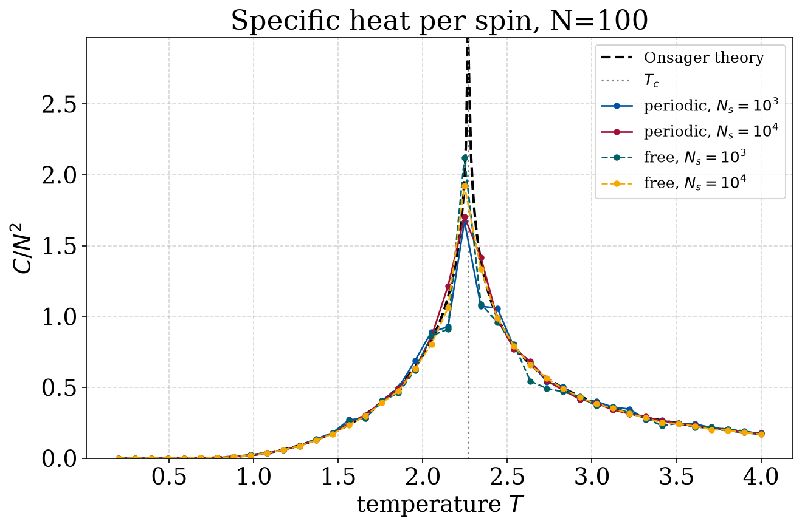

# The Ising model

The Ising model is a simple model of magnetism: a lattice of spins that each point
up or down and prefer to line up with their neighbours. Even though the rules are
simple, in two dimensions it has a real phase transition between an ordered
(magnetised) state at low temperature and a disordered one at high temperature.
This project reproduces that with the Metropolis Monte Carlo algorithm.

## Method

Spins only interact with their nearest neighbours, with energy
$E = -\sum_{\langle i j\rangle} S_i S_j$. The Metropolis algorithm samples spin
configurations at a temperature $T$: a random spin flip is accepted with
probability $\min(1, e^{-\Delta E/T})$. I work in natural units ($k_B = 1$), for
lattice sizes $N = 10, 50, 100$, both free and periodic boundaries, and
$N_s = 10^3$ to $10^4$ measurement sweeps.

Each temperature starts from the fully ordered state and is equilibrated before
anything is recorded; the internal energy $U$, specific heat $C$ and absolute
magnetisation $|M|$ are then taken as thermal averages over the following sweeps.
Starting ordered matters: below $T_c$ a random start easily freezes into two
domains with $|M| \approx 0.5$, which is a metastable trap rather than the true
equilibrium state.

## Results, 1D

In one dimension there is no phase transition; the chain is disordered at any
finite temperature. The simulated internal energy follows the exact result
$U/N = -\tfrac{N-1}{N}\tanh(1/T)$ across the whole temperature range:



## Results, 2D

In two dimensions order sets in below the critical temperature
$T_c = 2/\ln(1 + \sqrt{2}) \approx 2.269$. The magnetisation per spin stays near 1
(aligned) for $T < T_c$ and falls off above it, following the exact Onsager curve:


The agreement is not perfect right around $T_c$, and that is expected: Onsager's
result is for the infinite lattice, where the transition is perfectly sharp. A
finite $100\times 100$ lattice rounds it off, so $|M|$ leaks to small nonzero values
just above $T_c$ instead of dropping to exactly zero. The rounding is much stronger
for the small $N=10$ lattice (see `Plots/2D_M_10.png`) and shrinks as $N$ grows,
which is the usual finite-size behaviour.

The specific heat tells the same story. For the infinite lattice it diverges
(logarithmically) at $T_c$; the dashed theory curve runs off the top of the plot
there. The finite lattice instead shows a rounded peak of finite height, sitting
right at $T_c$:



Away from $T_c$ the simulation lands essentially on top of the Onsager energy and
specific heat. So a local, random update rule reproduces a collective effect, the
order-disorder transition, and recovers the exact Onsager results for the 2D
model, with the only deviations being the finite-size rounding near the critical
point.

## Running it

```bash
# 2D: generate the Monte Carlo data, then plot it
python 2D/Code_4_2D.py     # runs the simulation, writes to Data/2D/ (a few minutes)
python IM.py               # plots the 2D observables into Plots/

# 1D: tabulate then plot
python 1D/1D.py            # writes to Data/1D/
python 1D/plot.py          # writes to Plots/
```

- `IM.py` — plots the 2D observables against the Onsager theory
- `2D/Code_4_2D.py` — the 2D Monte Carlo engine (Numba-accelerated)
- `1D/1D.py`, `1D/plot.py` — 1D engine and plotting
- `Data/` — pre-computed results (`Data/1D/`, `Data/2D/`)
- `Plots/` — output figures

The data is already in `Data/`, so `IM.py` and `1D/plot.py` reproduce the figures
without rerunning the simulations. Dependencies: `numpy`, `matplotlib`, `scipy`
(see `requirements.txt` in the repo root).
