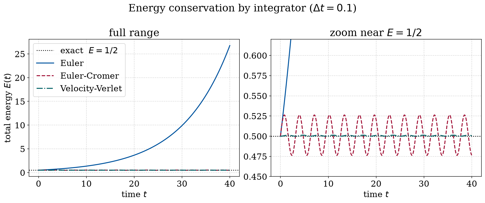
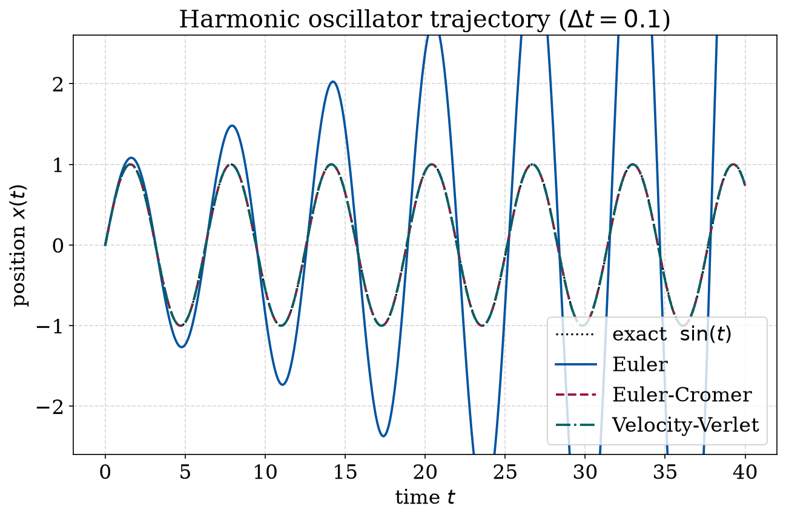
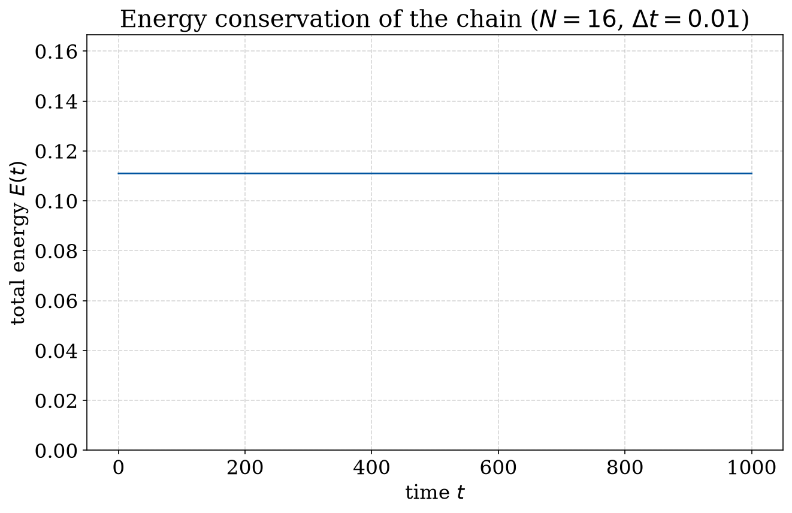

# Molecular dynamics: integrators and energy conservation

Molecular dynamics works by integrating Newton's equations step by step, and the
choice of integrator matters more than you might expect. Some schemes slowly add
or remove energy and ruin a long simulation, while others keep it almost constant.
Here I compare three of them on the harmonic oscillator and then use the best one
for a chain of coupled oscillators.

## Method

For the 1D harmonic oscillator $\ddot{x} = -x$ (unit mass and spring constant, exact
solution $x(t) = \sin t$, conserved energy $E = \tfrac{1}{2}$), I compare three explicit
schemes at the same time step:

- **Euler**: updates position and velocity from the old state. Not symplectic.
- **Euler-Cromer**: uses the new velocity to update the position. Symplectic.
- **Velocity-Verlet**: a symmetric half-kick / drift / half-kick step. Symplectic
  and second order.

## Results, a single oscillator

Plotting the total energy makes the difference obvious. The left panel shows the
full range: the Euler energy grows without bound. The right panel zooms in near
$E = \tfrac{1}{2}$, where you can see Euler-Cromer oscillating around the exact value
while Velocity-Verlet stays glued to it:



The trajectories tell the same story. Euler's amplitude keeps growing, while the
two symplectic methods stay on top of the exact sine curve:



## Results, a chain of coupled oscillators

Using Velocity-Verlet on a chain of $N = 16$ coupled masses, started in a
standing-wave (normal mode) initial condition, the total energy drifts by only
about $8\times 10^{-6}$ (relative) over 1000 time units, which is the kind of long-term
stability you want from a symplectic integrator:



The short version: the symplectic methods conserve energy over long runs where
plain Euler falls apart, which is why Velocity-Verlet is the one normally used in
real molecular dynamics codes.

## Running it

```bash
python oscillator_integrators.py   # single-oscillator comparison -> Plots/
python coupled_oscillators.py      # coupled chain -> Plots/
```

- `oscillator_integrators.py` — single-oscillator integrator comparison
- `coupled_oscillators.py` — coupled-oscillator chain (Velocity-Verlet)
- `Plots/` — output figures

Dependencies: `numpy`, `matplotlib` (see `requirements.txt` in the repo root).
