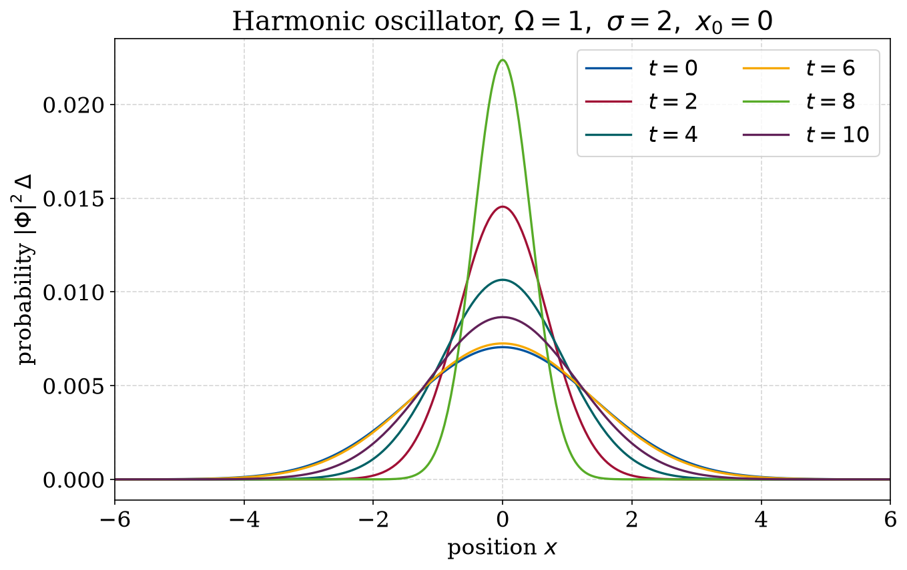

# Quantum harmonic oscillator

This solves the time-dependent Schrödinger equation for a Gaussian wave packet in
a harmonic potential, and compares the result against the exact analytic answer.

## Method

The TDSE is solved in units $m = \hbar = 1$ for the potential $V(x) = \tfrac{1}{2}\Omega^2 x^2$,
using a matrix decomposition together with the second-order product formula for
the kinetic part (the same operator-splitting idea used in the other quantum and
diffusion projects here). The scheme keeps the norm exactly and is second order in
the time step. The initial state is a Gaussian packet of width $\sigma$ centred at
$x_0$. I used $\Delta = 0.025$, $L = 1201$ grid points and $\tau = 2.5\times 10^{-4}$.

The mean position and the variance are then compared with the exact expectation
values, for example $\langle x(t)\rangle = x_0\cos(\Omega t)$.

## Results

A packet displaced to $x_0 = 1$ behaves like a coherent state: it oscillates back and
forth across the well without changing shape, with period $2\pi/\Omega$. After one
full period ($t \approx 6.28$) it is back where it started, which you can see below from
the $t = 6$ curve sitting almost exactly on top of the $t = 0$ curve:


A wider packet centred in the well ($\sigma = 2$, $x_0 = 0$) is close to a stationary
state and only breathes slightly around the centre:



So the product-formula solver reproduces the defining behaviour of the quantum
harmonic oscillator, a shape-preserving oscillation at the classical frequency,
directly from the time-dependent equation.

## Running it

```bash
python plot_results.py   # quick: plots the stored snapshots -> Plots/
python QHO.py            # the full (slow) time evolution -> Data/, Plots/
```

- `QHO.py` — the full time-evolution solver (Numba + multiprocessing)
- `plot_results.py` — quick plots from the stored snapshots
- `Data/` — stored $|\Phi(x,t)|^2$ snapshots
- `Plots/` — output figures

The full solver runs several parameter sets in parallel; `plot_results.py` just
reads the stored snapshots in `Data/`, so it reproduces the figures right away.
Dependencies: `numpy`, `matplotlib`, `numba` (see `requirements.txt` in the repo root).
