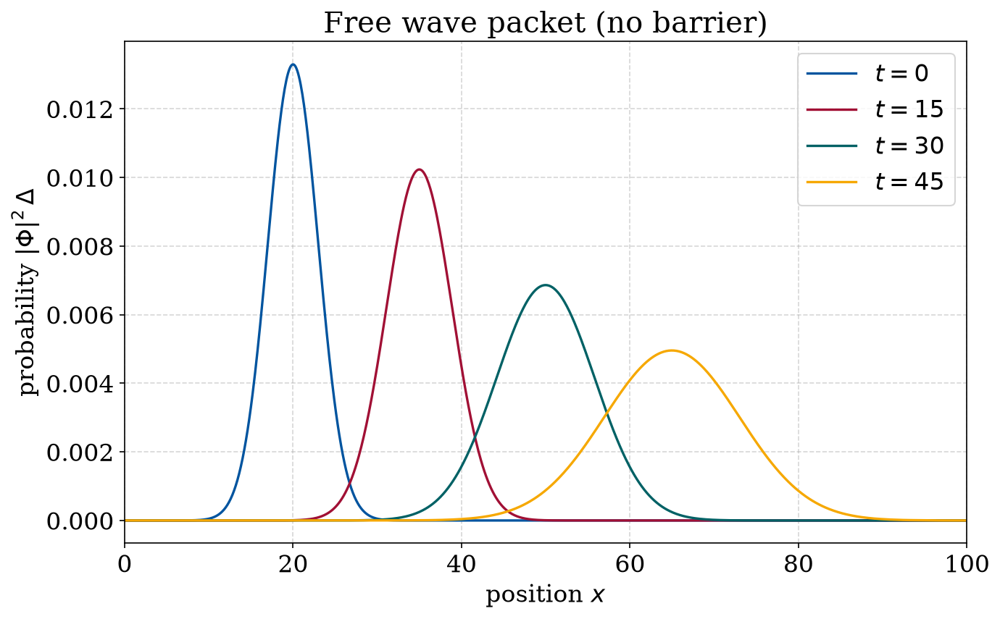
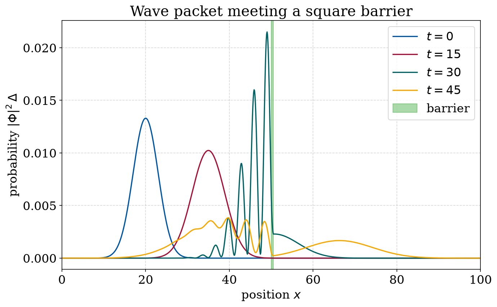
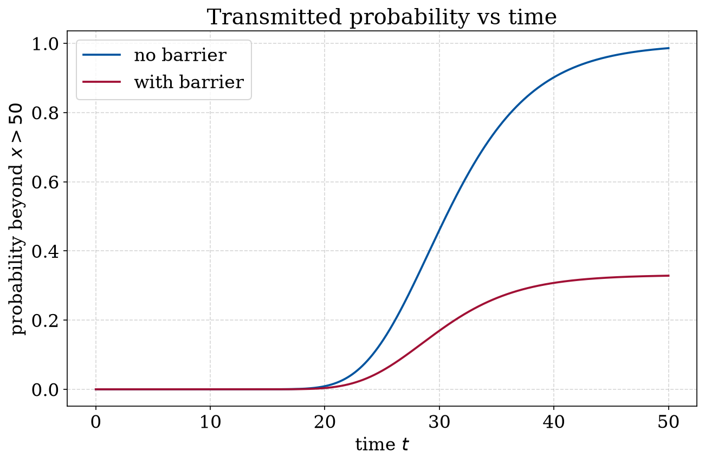

# Quantum tunnelling through a potential barrier

One of the more surprising predictions of quantum mechanics is tunnelling: a
particle can get through a barrier that, classically, it does not have enough
energy to cross. This project shows it directly by sending a wave packet at a
square barrier and watching part of it come out the other side.

## Method

The time-dependent Schrödinger equation (units $m = \hbar = 1$) is solved for a
Gaussian wave packet with the second-order product formula. One time step is split
into kinetic sub-steps acting on neighbouring pairs of grid points and a diagonal
potential step, arranged symmetrically so the step is second order and keeps the
norm exactly constant. The domain is $0 \le x \le 100$ on $L = 1001$ points, with
$\tau = 10^{-3}$ and $5\times 10^4$ time steps.

I compare two cases: a free particle (no potential), and a square barrier $V = 2$ on
$50 \le x \le 50.5$, which is higher than the packet's mean energy.

## Results

With no barrier the packet just moves to the right and spreads out:



With the barrier in place the packet piles up against it (the fringes come from
the incident and reflected waves overlapping), and then splits: part is reflected
and part tunnels through to the far side, which is the hump past $x = 50$ at $t = 45$:



Tracking how much probability has reached the far side makes it quantitative. The
free particle transmits almost everything (about 99 %), while the barrier case
levels off at roughly 33 %, which is the tunnelling probability:



So a norm-preserving product-formula solver captures tunnelling from the equation
itself: a packet with less energy than the barrier still leaves a finite,
measurable probability on the other side.

## Running it

```bash
python plot_results.py            # quick: plots the stored wavefunctions -> Plots/
python SE_Potential_Barrier.py    # the full (slow) solver -> Data/, Plots/
```

- `SE_Potential_Barrier.py` — the TDSE solver (uses Numba)
- `plot_results.py` — quick plots from the stored wavefunctions
- `Data/` — stored $\Phi(x,t)$ snapshots and probability time series
- `Plots/` — output figures

The solver stores snapshots in `Data/`, so `plot_results.py` reproduces the figures
without the 50 000-step run. Set the `barrier` flag in `SE_Potential_Barrier.py` to
`False` (free particle) or `True` (barrier). Dependencies: `numpy`, `matplotlib`,
`numba` (see `requirements.txt` in the repo root).
