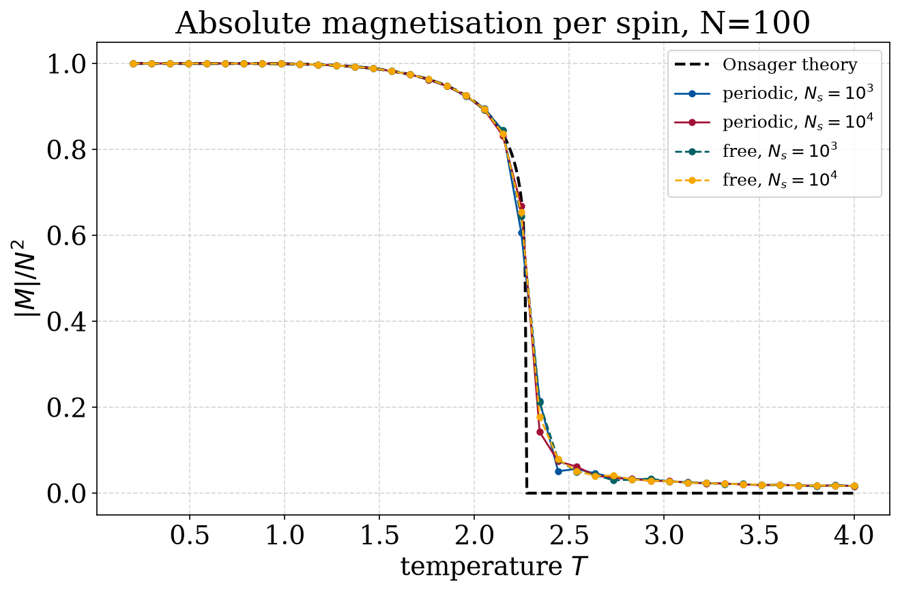
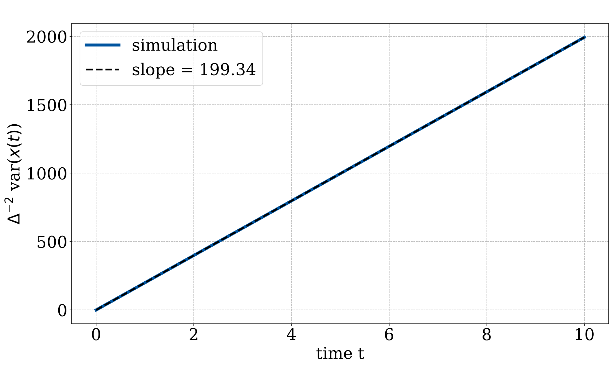
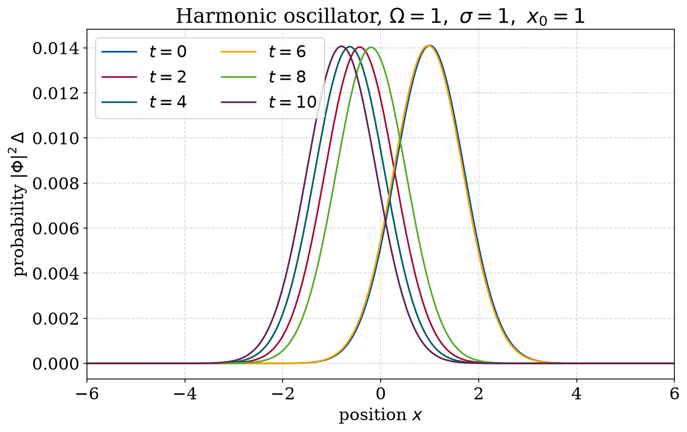

# Computational Physics

Numerical simulations I wrote while learning computational physics. They cover a
few different areas: statistical mechanics, classical dynamics, electromagnetism
and quantum mechanics. Each folder has a short report with the figures, the code
that produces them, and the data needed to reproduce the results.

Everything is written in Python (NumPy, Numba, Matplotlib, SciPy). The heavier
solvers use Numba for speed, and the plots render without needing a LaTeX
install.

## Projects

### [Ising Model](./Ising-Model)
Metropolis Monte Carlo for the 1D and 2D Ising model. The 2D case shows the
order-disorder phase transition and reproduces the exact Onsager magnetisation.

[](./Ising-Model)

### [Molecular Dynamics](./Molecular-Dynamics)
Euler, Euler-Cromer and Velocity-Verlet integrators compared on the harmonic
oscillator, plus a chain of coupled oscillators.

[](./Molecular-Dynamics)

### [Electrodynamics](./Electrodynamics)
1D FDTD (Yee algorithm) for a light pulse reflecting and transmitting at a glass
plate, including what happens when the Courant stability limit is broken.

[](./Electrodynamics)

### [Diffusion Equation](./Diffusion-Equation)
A second-order product-formula solver for the diffusion equation, checked against
a random walk.

[](./Diffusion-Equation)

### [Quantum Harmonic Oscillator](./Quantum-Harmonic-Oscillator)
Time-dependent Schrödinger equation for a Gaussian packet in a harmonic well.

[](./Quantum-Harmonic-Oscillator)

### [Quantum Potential Barrier](./Quantum-Potential-Barrier)
Time-dependent Schrödinger equation for a wave packet hitting a square barrier,
showing reflection and tunnelling.

[](./Quantum-Potential-Barrier)

## Layout

Each project folder looks like this:

```
<Project>/
  README.md     the project write-up, with figures and how to run it
  *.py          source code
  Data/         input/result arrays (where used)
  Plots/        output figures (PNG)
```

## License

[MIT](./LICENSE).
